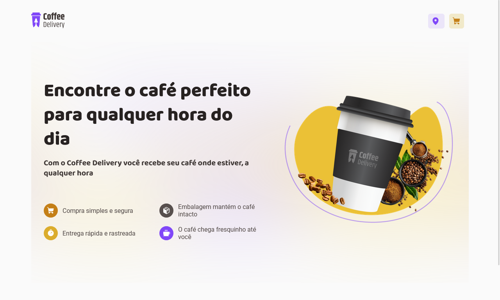

<h1 align="center">
  <image src=".github/logo.svg"/>
</h1>

 

  

## 🚀 Tecnologias

Tecnologias utilizadas no projeto:

- ReactJS
- Vite
- Typescript
- Styled Components
- Phosphor React
- React router
- React Toastify

 

## 💻 Projeto

O Coffee Delivery é uma aplicação fictícia na qual podemos comprar vários tipos de café e possui uma página de checkout com preenchimento de CEP e método de pagamento.

 

## ⚒️ Features

- [x] Adicionar café no carinho
- [x] Remove café do carinho
- [x] CEP automático
- [x] Método de pagamento
- [x] Soma de todos os café

 

## 🔖 Layout

Layout da aplicação no [figma](https://www.figma.com/file/5yT9ZzZmRQRS4yivGGB3pl/Coffee-Delivery/duplicate?node-id=0-1).

 

## 🌐 Deploy

Você pode ver o site clicando <a href="https://coffee-delivery-wheat.vercel.app/" target="_blank">nesse link</a>.

 

## :memo: Licença

Esse projeto está sob a licença MIT. Veja o arquivo <a href="https://github.com/Gabriel-Sousa/coffee-delivery/blob/main/.github/LICENSE" target="_blank">LICENSE</a>  para mais detalhes.

---

Feito com ♥ por Gabriel Sousa
